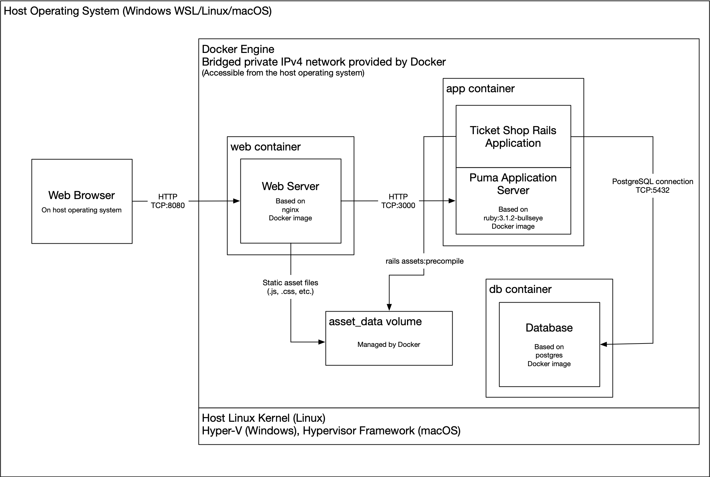
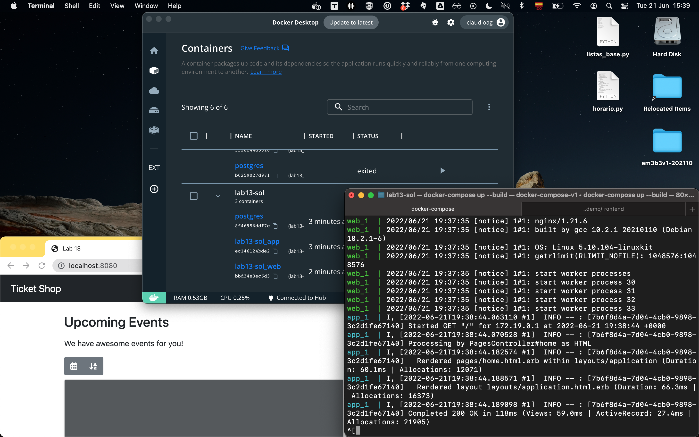

# Solution to Lab Assignment #13
**Names:** (write your names here)

## Introduction

In this lab assignment you will see how a Rails application can be run in production mode by means of a Docker container running on your local machine. You will be shown how DockerFiles are created, how a service composition is accomplished by means of Docker Compose, including a PostgreSQL database, a reverse proxy with nginx and the Ticket Shop rails application. You will see how Docker images are built based on DockerFiles. Lastly, you will be able to use the Ticket Shop application in production mode.

You may continue to work in pairs.

## Pre-requisites

* Make sure you have at least 5 GB of free disk space, as you will be building Docker images locally.
* Install [Docker Desktop](https://docs.docker.com/desktop/#download-and-install) on your host operating system (Windows+WSL2, macOS or Linux VM/host). Here are the [instructions for Debian](https://docs.docker.com/engine/install/debian/).
* If you run Docker on Linux (e.g. in the course VM), be sure to add the user (e.g. webtech) to the docker group after installing docker. Do it like this:
```sh
$ sudo usermod -aG docker $USER
```
* After installing Docker and doing the above, restart your virtual machine (if you run Docker in a VM) or host computer.

## A brief introduction to Docker and Docker Compose

[Docker Desktop](https://docs.docker.com/desktop/) is an easy-to-install application for your Mac or Windows environment that enables you to build and share [containerized applications](https://www.freecodecamp.org/news/a-beginner-friendly-introduction-to-containers-vms-and-docker-79a9e3e119b/). Docker Desktop includes several applications and services, including [Docker Engine](https://docs.docker.com/engine/), Docker CLI client, Docker Compose, Docker Content Trust, Kubernetes, and Credential Helper.

After you’ve successfully installed and started Docker Desktop, is is recommended that you authenticate using the Sign in/Create ID option from the Docker menu. Authenticated users get a higher pull rate (i.e., ability to download images) limit compared to anonymous users. For example, if you are authenticated, you get 200 pulls per 6 hour period, compared to 100 pulls per 6 hour period per IP address for anonymous users. For more information, see Download rate limit.

[Docker Compose](https://docs.docker.com/compose/) is a tool for defining and running multi-container Docker applications. With Compose, you use a YAML file (i.e., `docker-compose.yml`) to configure your application’s services. Then, with a single command, you create and start all the services from your configuration. To learn more about all the features of Compose, see the list of features.

With Docker and Docker Compose, you may easily set up a complex web application deployment, comprising several services, as we will see in the following section.

## Running the Ticket Shop in production mode

The figure below shows the architecture of the current Ticket Shop application deployment in production mode. Operation of the application is based on three containers. Firstly, there is a container running the nginx web server (i.e., '`web`' container). This web server serves static assets that belong to the application, and forwards requests to the Puma application server that runs in the '`app`' container.

The '`web`' and '`app`' containers share a storage volume called '`asset-data`'. The rails application precompiles its assets with sprockets and leaves the corresponding static files in the '`asset-data`' volume. The nginx web server accesses the volume each time a request from the web browser starts with `/assets/` on its path.



The database used by the Ticket Shop application is run in a separate `db` container, based on the latest PostgreSQL image. The database server and the web application require secret files containing the username and password that is to be used for database authentication. These files are kept in another special volume managed by Docker, which is called `secrets`.

## Preparing the Ticket Shop application for operations in production mode

### Rails' configuration credentials

Before Docker images are built, it is necessary to set up an encrypted configuration file for the Ticket Shop application. That is, we do not want hackers to get their hands on a configuration file in plain text in a production server. For this, a master key to encrypt the configuration is needed. These steps are well described in the [Rails Guides](https://edgeguides.rubyonrails.org/security.html#custom-credentials). 

First, delete the pre-existing encrypted configuration file (run this from the `RAILS_ROOT` directory):

```sh
$ rm config/credentials.yml.enc
```

Now, you will need to execute the following:

```sh
$ EDITOR="code --w" bin/rails credentials:edit
```

Note that the above requires VSCode installed. You may use another editor, such as VIM (provided that you know how to use it, and, ahem, how to quit):

```sh
$ EDITOR="vim" bin/rails credentials:edit
```

### Database secrets and configuration

Next, you need to create files containing user name and password for the database. For this, go to the `RAILS_ROOT/secrets` directory, and therein create the following files:

* `database_username.txt`: Keep the database user name in this file (which is not in source control, look at `.gitignore` and you will see there are rules about this). Make sure there is no newline character after the password.
* `database_password.txt`: Keep the database password in this file (which is also not in source control). Make sure there is no newline character after the password.

Now, take a look at the `Gemfile` and see that the `pg` gem has been added in production mode, so that ActiveRecord uses PostgreSQL as the underlying database management system. In development mode, `sqlite` has been kept as in past lab assignments.

Also, go to `config/database.yml`. See that PostgreSQL configuration in production mode uses the `db_username` and `db_password` files configured in `docker-compose.yml` as secrets.

### Docker configuration files

Open the file `RAILS_ROOT/docker_compose.yml` to see how the `web`, `app` and `db` service containers are configured. DockerFiles in `RAILS_ROOT/docker/app/DockerFile` and `RAILS_ROOT/docker/web/DockerFile` are used to configure the images required by the Ticket Shop application, and the nginx web server. With regard to the latter, there is an `nginx.conf` file that is used to override the default configuration and be able to serve Rails' static files.

## Build images and launch the Ticket Shop app

To launch the containers that are required for the operation of the Ticket Shop in production mode, run the following commands:

```
$ docker-compose up --build # builds all images and launches them in containers as needed
```

You will see the output of the entire image building process per service defined in `docker-compose.yml`. After images are built, service containers are launched one by one. Dependencies among containers are specified in the YAML file (see how `app` depends on `db`, and how `web` depends on `app`). 

If you have a look at `RAILS_ROOT/docker/app/DockerFile` you will see how application files are copied into the Docker image, how assets are precompiled, how the database is migrated by means of an entrypoint script (available at `lib/docker-entrypoint.sh`), and finally, how the puma web server is launched by means of a `CMD` command.

Once all containers are up and running, you may connect to the application by opening http://localhost:8080 on your web browser.

To stop containers, press ctrl+c on the terminal window where docker-compose runs.

Here are a few useful commands options to use with `docker-compose`:

```
$ docker-compose up -d # runs containers detached from the command line
```

The above will allow you to continue to use the console after containers have been launched. 

The command below will stop the containers and remove named volumes declared in the `volumes` section of the Compose file and anonymous volumes attached to containers.

```
$ docker-compose down -v 
```

### Create the Ticket Shop admin account

While your containers are running, open the Docker Desktop window, go to Containers / Apps and expand the 'lab13' group. Find the '`lab13_app`' (or '`lab13_app_1`') container in the list, and click on the command prompt button (`>_`). A terminal window will open. In that window, run the following command:

```sh
$ rails admin:create_admin_account
``` 

Enter your admin password, and confirm it. Then, you may go to http://localhost:8080/admins/sign_in and enter `admin@ticketshop.com` as email, and the password you entered before to sign in as administrator.

## The last (graded) steps of this lab

Answer the following questions below:

1. [1 point] Why is Docker useful? What problem(s) does it solve?

Docker provides container-level virtualization to run applications and services. This is a lightweight form of virtualization, as multiple containers can run as isolated processes on the same host machine, and sharing the share operating system kernel. There is no need for hardware emulation and a hypervisor as with traditional virtual machines. Also, software distribution is greatly facilitated by use of images, which can be published in online repositories, such as DockerHub. Thus, docker is a robust solution to the problems of: (1) running applications and software elastically, efficiently and securely by means of containers, (2) facilitate software installation and configuration management by means of software images. 

2. [.5 point] What is a Docker image?

A Docker image may contain all necessary software and dependencies required to run a piece of software autonomously in a container. An image for a web application can be built upon a base image, for instance, containing a functional operating system (e.g. Ubuntu Server, Debian, etc.) which greatly facilitates installation of an application along with its dependencies in a production environment.

3. [.5 point] What is a Docker container?

A Docker container provides the computational resources (CPU, memory, network hardware, storage, etc.) needed to run a piece of software (application, daemon, script, etc.) in isolation from other processes and containers that run on the host machine.

4. [1 point] What is the role of Docker Compose?

Docker Compose permits running multiple Docker containers concurrently and interdependently. It can build all the images needed by the services that run on the containers, provide storage volumes, secret management, etc.

5. [3 points] Take a screenshot of your entire desktop showing: Docker Desktop running (1 point), the terminal window showing the containers of the Ticket Shop application running (`docker-compose up`; 1 point), and a web browser connected to http://localhost:8080 showing the application running (1 point). Put the screenshot in the `docs/imgs` folder. **Do not hand in separate screenshots. Make it a single screenshot image.**




## Useful links

The following links to Rails Guides will provide you useful information for completing your assignment:

* [Configuring Rails Applications](https://edgeguides.rubyonrails.org/configuring.html)
* [A Beginner-Friendly Introduction to Containers, VMs and Docker](https://www.freecodecamp.org/news/a-beginner-friendly-introduction-to-containers-vms-and-docker-79a9e3e119b/)
* [Docker Overview](https://docs.docker.com/get-started/overview/)
* [Get Docker](https://docs.docker.com/get-docker/)
* [Docker Compose File Specification](https://docs.docker.com/compose/compose-file/)
* [Dockerfile Reference](https://docs.docker.com/engine/reference/builder/)
